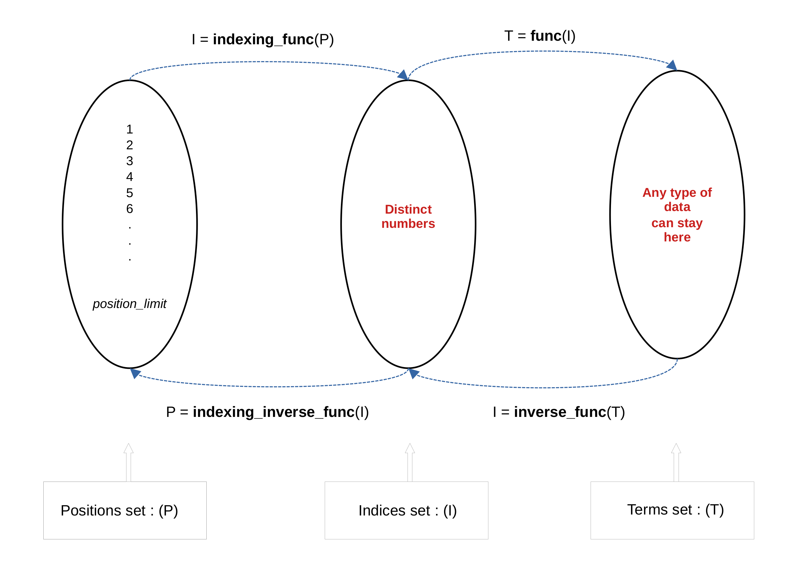

# NSequence

NSequence is a Python library designed for handling progressions or sequences. It allows users to define sequences through functional expressions, and offers capabilities for various computations.


## Key Features

- **Versatile Sequence Handling**: NSequence supports every type of sequence, as long as it can be expressed with a unary function.

- **Error Handling**: The library includes robust error handling for scenarios such as arity mismatches, unexpected positions or indices, inversion errors, and index not found situations.

- **Custom Indexing**: Users can define custom indexing functions to map sequence positions to unique indices, accommodating sequences with non-standard progressions or skipped elements. This feature enhances the library's versatility in sequence management.

- **Inverse Functionality**: For invertible sequences, NSequence facilitates finding the index of a given term and vice versa and provides various operations based on the inversion. 

- **Nearest Term Search**: NSequence allows you to find the index of the nearest term to a given value in the sequence. It provides flexibility in handling tie-breakers and preferences.

- **Iterator Protocol Support**: NSequence supports the iterator protocol, allowing seamless iteration over sequence elements.

- **Sequence Protocol Support**: NSequence adheres to the sequence protocol, ensuring compatibility with other Python sequences and enabling familiar operations such as indexing and slicing.

## Installation

You can install NSequence using pip:

```bash
pip install nsequence
```

## Testing

You can install the dependencies to run the tests using pip:

```bash
pip install nsequence[dev]
```

## Getting Started

```python
from NSequence import NSequence

def my_function(x):
    # Do something with x and return what you want
    # ...
    return x * 2

# Create your sequence
my_sequence = NSequence(func=my_function)

# Use the sequence functionalities
term_3 = my_sequence.nth_term(3)
sum_first_5_terms = my_sequence.sum_up_to_nth_term(5)
```

```python
# Create a linear sequence: f(x) = 2x + 3
linear_sequence = NSequence(func=lambda x: 2 * x + 3)

# Compute the 5th term
term_5 = linear_sequence.nth_term(5)

# Find the index of the term 13
index_of_13 = linear_sequence.index_of_term(13)

# Calculate the sum of the first 10 terms
sum_first_10_terms = linear_sequence.sum_up_to_nth_term(10)
```

```python
# Create a quadratic sequence: f(x) = x^2 + 3
quadratic_sequence = NSequence(func=lambda x: x ** 2 + 3)

# Get the nearest term to 20
nearest_term_to_20 = quadratic_sequence.nearest_term(20)

# Count the terms between 10 and 50
count_terms_between_10_and_50 = quadratic_sequence.count_terms_between_terms(10, 50)
```

```python
# Create an invertible sequence with inverse function
invertible_sequence = NSequence(func=lambda x: 2 * x, inverse_func=lambda y: y / 2)

# Find the index of the term 8
index_of_8 = invertible_sequence.index_of_term(8)

# Compute the terms between indices 5 and 10
terms_between_5_and_10 = invertible_sequence.terms_between_indices(5, 10)
```

## Real-world Usage

Imagine you're developing a complex event reminder system, where specific data _could_ be 
attached to each reminder. You don't want to save in db, reminders to which the user 
hasn't attached any specific data (you're seeing it as resource waste). But, for forecasting and
planning purposes, you want to be able to retrieve 
for a given event recall data (or metadata inferred from the related event) for a 
given period in the past (or future).

The set of reminders can be conceptualized as a mathematical sequence, where each 
term represents a distinct instance of the scheduled event reminder.

Consider an event requiring reminders every `F` hours starting from a date `D`. 
We can establish a direct mathematical relationship between 
each reminder instance and its timing. And we can then define the reminder sequence 
using the formular `R(n) = D + F*(n-1)` or `R(n) = (D-F) + F*n`, where `R(n)` represents the `n-th` reminder 
date.

NSequence can be utilized to enhance your code's capabilities in solving the
previous problem by leveraging the available methods.

```python

from datetime import datetime, timedelta
from nsequence import NSequence

# Define start date and frequency in hours
start_date = datetime(2024, 1, 1)
frequency_hours = timedelta(hours=2)

# Define the reminder function using the R(n) formula
def reminder_func(n):
    # R(n) = start_date + frequency_hours * (n-1)
    return start_date + frequency_hours * (n-1)

def reminder_inverse_func(reminder_date):
    return (reminder_date - start_date + frequency_hours) / frequency_hours

# Initialize NSequence with the reminder function
reminder_sequence = NSequence(
    func=reminder_func, 
    # Set initial_index to 1
    initial_index=1, 
    inverse_func=reminder_inverse_func
)

# Example: Get the 5th reminder date
fifth_reminder_date = reminder_sequence.nth_term(5)
print(f"The 5th reminder is scheduled for: {fifth_reminder_date}")

# Example: Get the reminders scheduled between two different dates
date1 = datetime(2024, 1, 1)
date2 = datetime(2024, 2, 4)

scheduled_reminders_between_dates = reminder_sequence.terms_between_terms(date1, date2)
print(f"The scheduled reminder between {date1} and {date2} are: {scheduled_reminders_between_dates}")

# See bellow for more methods available
```

- _NSequence has custom indexing support to handle more complex sequence definition._

- _Inheritance can be used to override the default methods if the default implementation does not suit your needs
especially in the cases where the return type of the sequence's function is not float._

## Key Methods



---
### Constructor .i.e `__init__`

Initializes a new sequence instance.

#### Parameters

- `func`: The primary function defining the sequence. This function must accept an integer position and return the corresponding sequence term.

- `inverse_func`: An optional inverse function for `func`, allowing for the computation of positions or indices based on sequence term values.

- `indexing_func`: An optional function that maps sequence positions to custom indices, enabling non-standard indexing schemes.

- `indexing_inverse_func`: The inverse of `indexing_func`, allowing for the determination of sequence positions from indices.

- `initial_index`: The starting index for the sequence, defaults to 0. This parameter is ignored if `indexing_func` is provided, as the initial index will then be derived from the indexing function.

-  `position_limit` An optional limit to the number of positions available in the sequence .i.e the length of the sequence. Defaults to 1,000,000.


#### Raises
- `ArityMismatchError`: Raised if the provided function does not accept exactly one argument.
- `TypeError`: Raised if the provided argument is not a callable function.

### `nth_term`
Computes the sequence term at the given position.

#### Parameters
- `position`: Position in the sequence to calculate the term for.


### `position_of_index`
Determines the sequence position of a given index, useful when custom indexing is used.

#### Parameters
- `index`: The index for which to find the corresponding sequence position.

#### Raises
- `IndexNotFoundError`: Raised if the user provides custom indexing function and the index is not found sequence's `position_limit`. 

### `nearest_entry`
Finds the nearest sequence entry (both the index and the term) to a given term.

#### Parameters
- `term_neighbor`: The term to find the nearest sequence entry for.
- `inversion_technic`: Whether to use the inversion technique for finding the nearest term.
- `starting_position`: The starting position for the iterative search (ignored if `inversion_technic` is True).
- `iter_limit`: The maximum number of iterations for the search (ignored if `inversion_technic` is True).
- `prefer_left_term`: Preference for the left term in case of equidistant terms.

#### Raises
- `NotImplementedError`: Raised if the calculation fails, due to `TypeError`, `ValueError` or `ArithmeticError`.

### `nearest_term_index`
Finds the index of the nearest term to a given value in the sequence.

#### Parameters
- `term_neighbor`: The value to find the nearest sequence term to.
- `inversion_technic`: Whether to use the inversion technique for finding the nearest term.
- `starting_position`: The starting position for the iterative search (ignored if `inversion_technic` is True).
- `iter_limit`: The maximum number of iterations for the search (ignored if `inversion_technic` is True).
- `prefer_left_term`: Preference for the left term in case of equidistant terms.

#### Raises
- `NotImplementedError`: Raised if the calculation fails, due to `TypeError`, `ValueError` or `ArithmeticError`.

### `nearest_term`
Retrieves the term in the sequence that is nearest to a specified value.

#### Parameters
- `term_neighbor`: The value to find the nearest sequence term for.
- `inversion_technic`: Whether to use the inversion technique for finding the nearest term.
- `starting_position`: The starting position for the iterative search (ignored if `inversion_technic` is True).
- `iter_limit`: The maximum number of iterations for the search (ignored if `inversion_technic` is True).
- `prefer_left_term`: Preference for the left term in case of equidistant terms.

#### Raises
- `NotImplementedError`: Raised if the calculation fails, due to `TypeError`, `ValueError` or `ArithmeticError`.
- `InversionError`: Raised if `inversion_technic` is set to True and the sequence does not have `inverse_func`.

### `count_terms_between_terms_neighbors`
Counts the number of terms located between the nearest terms to two specified values. This method is particularly useful for sequences where each term
has a unique and identifiable neighbor, allowing for the counting of terms that lie directly
between two specific values.

#### Parameters
- `term_neighbor1`: The first value.  This method finds the nearest term to this value
                 that does not prefer the left term, effectively preferring the right or equal term.
- `term_neighbor2`: The second value. The value of the second neighbor. Unlike for `term_neighbor1`, this method finds the
                 nearest term to this value that prefers the left term, if such a term exists.

### `terms_between_terms`
Computes a list of sequence terms located between two given terms, inclusive.

#### Parameters
- `term1`: The first term.
- `term2`: The second term.

#### Raises
- `InversionError`: Raised if `inverse_func` is not defined.
- `ValueError`: Raised if calculated indices are not valid or if `term1_index` or
`term2_index` are not integers.

### `sum_up_to_nth_term`
Calculates the sum of the sequence up to the nth term. 

#### Parameters
- `n`: The position up to which the sum is to be calculated. Must be a positive integer.

### `index_of_term`
Returns the sum of the sequence up to the nth term.

#### Parameters
- `term`:  The sequence term to find the index for.
- `inversion_technic`: If True and no inverse function is provided, uses a brute-force search to find the index. Defaults to True.
- `exact_exception`:  If True, raises an exception if the term does not exactly match any sequence term. Defaults to True.

#### Raises
- `InversionError`: Raised if `inversion_technic` is True and no inverse function is provided.
- `ValueError`: Raised if `exact_exception` is True and the term is not found in the sequence.

### `count_terms_between_indices`
Counts the number of terms between two indices in the sequence.

#### Parameters
- `index1`: The starting index.
- `index2`: The ending index.


### `count_terms_between_terms`
Counts the number of terms between two given terms in the sequence. It uses 
the sequence's inverse function.

This method is meaningful for sequences where a bijective (one-to-one and
onto) relationship exists between terms and their indices.

#### Parameters
- `term1`: The first term in the sequence.
- `term2`: The second term in the sequence.

#### Raises
- `InversionError`: Raised if an inverse function has not been defined or is not
applicable, indicating that term indices cannot be accurately determined.

## Properties

### `initial_index`
The initial index provided while creating the sequence.

### `initial_term`
The initial term of the sequence.

### `position_limit`
The actual length of the sequence.

## More
The support for Sterator and sequence Protocol allows you to do things like this:

```python
my_sequence = NSequence(func=lambda x: x**3 + 4, position_limit=20)

# Print each element/term of the sequence
for term in my_sequence:
    print(term)

# Slice to get a range of terms
print(my_sequence[start:end:step])

```
Read about Iterator protocol [here](https://docs.python.org/3/c-api/iter.html) and Sequence protocol [here](https://docs.python.org/3/c-api/sequence.html).

---

## Authors

- **Isaac Houngue** [<hjisaac.h at gmail>](mailto:hjisaac.h@gmail.com)

Feel free to contribute, report issues, or suggest enhancements. Did you know that sequences are everywhere 🤔? Happy sequencing! 📈
